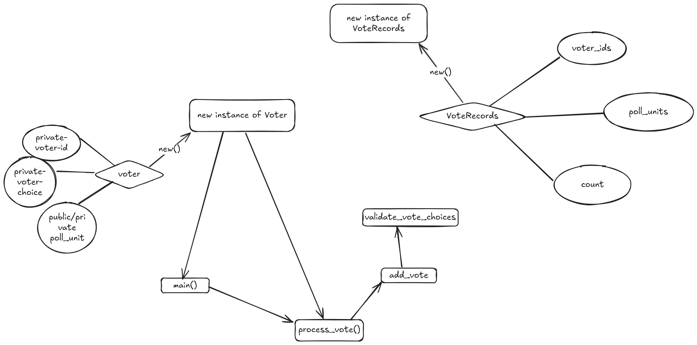

## This is a little repo of a mini circuit to replicate a private voting poll
### These is the flow
- A voter instance is created and the parts are added to the VoteRecords
- The process_vote() and the add_vote() have constraints in them to ensure the voters can only vote once

I could not make the number of voters be a growable array due to noir vm constraints. 

### To run the program , kindly run make - commands as arranged in the Makefile
If you encounter any issue from running make check , run make check-overwrite to replace the Prover.toml

